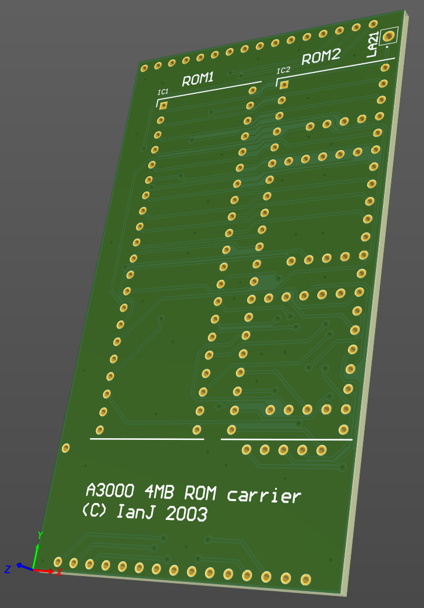

# Acorn A3000 "Big ROMs" board

January 2024

This is an implementation of a simpler ROM upgrade board for Acorn A3000 machines.
To accommodate 4MB ROM images, LA21 is requried, but pin 1 of the A3000 ROMs is hard-wired to VCC.
This carrier pulls in LA21 from a flying wire, but also uses two 16Mbit 42pin DIPs (27c160) as they're cheaper and more available than four 8Mbit 32pin DIPs (27c080).

This has been tested in an A3000 and does work, however care needs to be taken about the mounting height of the solution as use of standard SIL pins and ROM sockets means it fouls the keyboard.  Possible options are removing the original ROM sockets and soldering this board directly to the motherboard, or soldering the DIP42 parts directly to this board.

## Licence

No warranty is provided, and this work is used at your own risk.  

Licenced as CC BY-SA 4.0

Copyright 2024 Ian Jeffray

