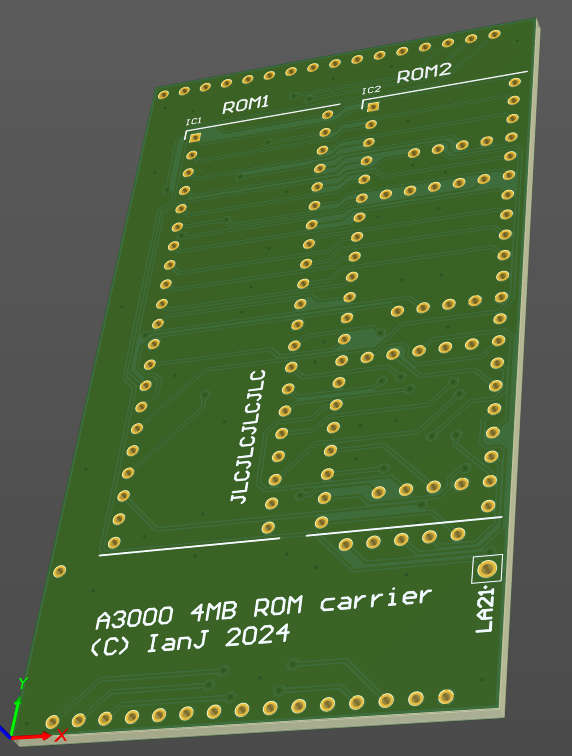

# Acorn A3000 "Big ROMs" board

June 2023

This is an UNFINISHED Work-in-progress implementation of a ROM upgrade board for Acorn A3000 machines.
To accommodate 4MB ROM images, LA21 is requried, but pin 1 of the A3000 ROMs is hard-wired to VCC.
This carrier pulls in LA21 from a flying wire, but also uses two 16Mbit 42pin DIPs (27c160) as they're cheaper and more available than four 8Mbit 32pin DIPs (27c080).

This has not yet been built or tested.

## Licence

No warranty is provided, and this work is used at your own risk.  

Licenced as CC BY-SA 3.0

Copyright 2023 Ian Jeffray

